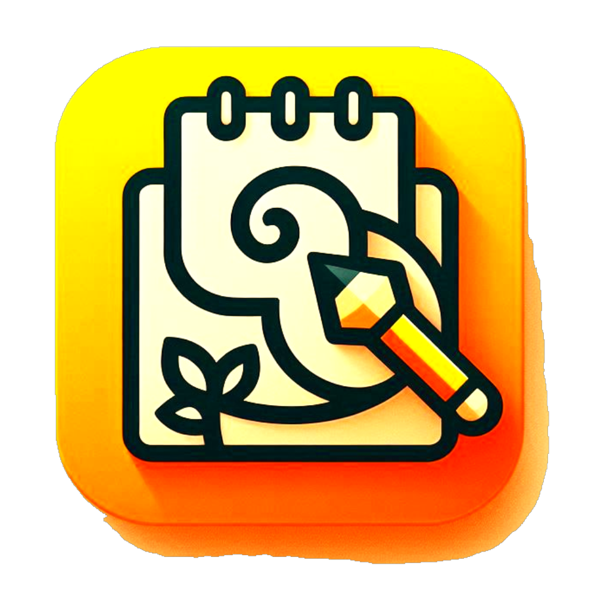
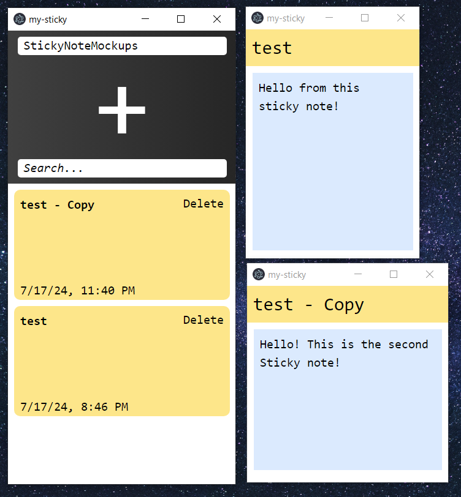

<!-- PROJECT SHIELDS -->
<!--
*** I'm using markdown "reference style" links for readability.
*** Reference links are enclosed in brackets [ ] instead of parentheses ( ).
*** See the bottom of this document for the declaration of the reference variables
*** for contributors-url, forks-url, etc. This is an optional, concise syntax you may use.
*** https://www.markdownguide.org/basic-syntax/#reference-style-links
-->
[![Contributors][contributors-shield]][contributors-url]
[![Stargazers][stars-shield]][stars-url]
[![Issues][issues-shield]][issues-url]

<!-- PROJECT LOGO -->
 

  

<h3 align="center">MySticky</h3>

  

    A rich text editing Sticky Notes.
     
     
    <a href="https://github.com/Vangike/My-Sticky/issues/new?labels=bug&template=bug-report---.md">Report Bug</a>
    ·
    <a href="https://github.com/Vangike/My-Sticky/issues/new?labels=enhancement&template=feature-request---.md">Request Feature</a>
  

<!-- ABOUT THE PROJECT -->
## About The Project (WIP)

A rich text Sticky Note powered by [TipTap](https://tiptap.dev/). The current project is still in development.  
The current state of the project is shown below:

(<a href="#readme-top">back to top</a>)

### Built With

* [![React][React.js]][React-url]
* [Electron](https://www.electronjs.org/)
* [Vite](https://vitejs.dev/guide/)

(<a href="#readme-top">back to top</a>)

<!-- GETTING STARTED -->
## Getting Started

The project is still getting fleshed out! Once the project is in a stable state, instructions will be 
provided.

(<a href="#readme-top">back to top</a>)

<!-- IMPLEMENTED -->
## Working Functionality

- Load in a folder and load in list of JSON sticky notes
- Parse in JSON files by Tiptap editor
- Autosaving 

(<a href="#readme-top">back to top</a>)

<!-- ROADMAP -->
## Roadmap

- [ ] Load content of a sticky note after modification
- [ ] Create a new sticky note
- [ ] Delete a sticky note
- [ ] Individual sticky notes UI
- [ ] Color customization of sticky notes
- [ ] Editor implementation

(<a href="#readme-top">back to top</a>)

<!-- CONTACT -->
## Contact

[@DapMike_Codes](https://twitter.com/DapMike_Codes)
[https://github.com/Vangike/My-Sticky](https://github.com/Vangike/My-Sticky)

(<a href="#readme-top">back to top</a>)

<!-- ACKNOWLEDGMENTS -->
## Acknowledgments

* [Readme Template](https://github.com/othneildrew/Best-README-Template)

(<a href="#readme-top">back to top</a>)

<!-- MARKDOWN LINKS & IMAGES -->
<!-- https://www.markdownguide.org/basic-syntax/#reference-style-links -->
[contributors-shield]: https://img.shields.io/github/contributors/Vangike/My-Sticky.svg?style=for-the-badge
[contributors-url]: https://github.com/Vangike/My-Sticky/graphs/contributors
[forks-shield]: https://img.shields.io/github/forks/Vangike/My-Sticky.svg?style=for-the-badge
[forks-url]: https://github.com/Vangike/My-Sticky/network/members
[stars-shield]: https://img.shields.io/github/stars/Vangike/My-Sticky.svg?style=for-the-badge
[stars-url]: https://github.com/Vangike/My-Sticky/stargazers
[issues-shield]: https://img.shields.io/github/issues/Vangike/My-Sticky.svg?style=for-the-badge
[issues-url]: https://github.com/Vangike/My-Sticky/issues
[license-shield]: https://img.shields.io/github/license/Vangike/My-Sticky.svg?style=for-the-badge
[license-url]: https://github.com/Vangike/My-Sticky/blob/master/LICENSE.txt
[linkedin-shield]: https://img.shields.io/badge/-LinkedIn-black.svg?style=for-the-badge&logo=linkedin&colorB=555
[linkedin-url]: https://linkedin.com/in/linkedin_username
[product-screenshot]: images/screenshot.png
[Next.js]: https://img.shields.io/badge/next.js-000000?style=for-the-badge&logo=nextdotjs&logoColor=white
[Next-url]: https://nextjs.org/
[React.js]: https://img.shields.io/badge/React-20232A?style=for-the-badge&logo=react&logoColor=61DAFB
[React-url]: https://reactjs.org/
[Vue.js]: https://img.shields.io/badge/Vue.js-35495E?style=for-the-badge&logo=vuedotjs&logoColor=4FC08D
[Vue-url]: https://vuejs.org/
[Angular.io]: https://img.shields.io/badge/Angular-DD0031?style=for-the-badge&logo=angular&logoColor=white
[Angular-url]: https://angular.io/
[Svelte.dev]: https://img.shields.io/badge/Svelte-4A4A55?style=for-the-badge&logo=svelte&logoColor=FF3E00
[Svelte-url]: https://svelte.dev/
[Laravel.com]: https://img.shields.io/badge/Laravel-FF2D20?style=for-the-badge&logo=laravel&logoColor=white
[Laravel-url]: https://laravel.com
[Bootstrap.com]: https://img.shields.io/badge/Bootstrap-563D7C?style=for-the-badge&logo=bootstrap&logoColor=white
[Bootstrap-url]: https://getbootstrap.com
[JQuery.com]: https://img.shields.io/badge/jQuery-0769AD?style=for-the-badge&logo=jquery&logoColor=white
[JQuery-url]: https://jquery.com 